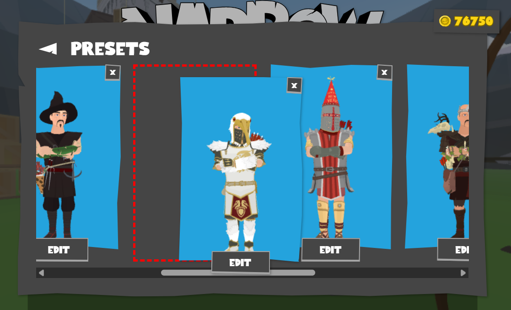
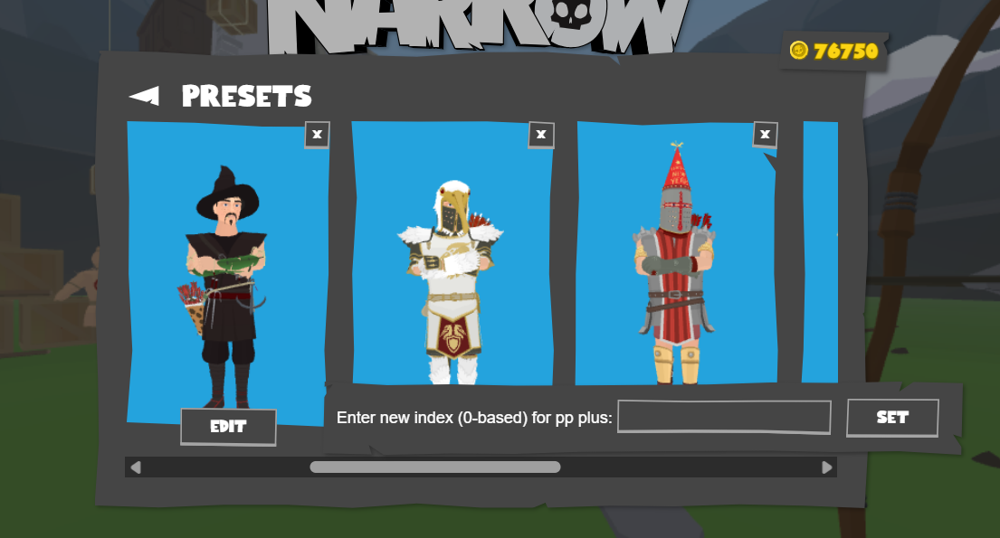

# Sort Presets

This mod allows you to sort your presets by drag-and-drop or by explicitly setting a new index for a preset.
> [!IMPORTANT]
> The sorting will only apply after refreshing.  
> If you edit a preset after sorting, the changes will **not** apply.

Setting a preset index explicitly is also compatible with my <a href="../renamePresets/">renamePresets</a> mod.  
 
  

